<h1 align="center">👋 Hi, I'm Mohd Zaheer Uddin</h1>

  🎓 3rd Year, 1st Semester CSIT Student 
  🤖 AI & Machine Learning Enthusiast 
  🐍 Python Developer 
  💼 Looking for internship opportunities

## 👋 About Me

I'm a **3rd Year, 1st Semester CSIT student** passionate about **Artificial Intelligence, Machine Learning, and Python development**.

I enjoy turning ideas into practical projects while continuously improving my programming and problem-solving skills. I'm currently exploring **AI/ML, data science, and vibe coding**, and I enjoy experimenting with new tools and building useful real-world applications.

🎯 **My current focus:** learning, building, experimenting, and preparing for internship opportunities.

  
  
  
  

---

## 🧠 Skills & Technologies

### 💻 Languages
- Python

### 🤖 AI / Machine Learning
- Artificial Intelligence
- Machine Learning
- Scikit-learn

### 📊 Data Science
- Pandas
- NumPy
- Matplotlib
- Jupyter Notebook
- Google Colab

### 🛠️ Development & Tools
- Git
- GitHub
- VS Code
- Streamlit
- Vibe Coding

### 📚 Familiar With
- C/C++ fundamentals

---

## 💼 Projects

### 🏠 House Price Prediction
🔗 [View on GitHub](https://github.com/SohailKhan0525/HousePricePrediction)

### 🫀 Heart Disease Prediction
🔗 [View on GitHub](https://github.com/SohailKhan0525/HeartDiseaseML)

### 🌍 Earthquake Prediction
🔗 [View on GitHub](https://github.com/SohailKhan0525/Global-Earthquake-Prediction)

### 🎓 Student Pass/Fail Prediction
🔗 [View on GitHub](https://github.com/SohailKhan0525/StudentFailPassPredictor)

### 🎓 Student Management
🔗 [View on GitHub](https://github.com/SohailKhan0525/StudentManagementProject)

### 🏦 Bank Management
🔗 [View on GitHub](https://github.com/SohailKhan0525/BankManagementProject)

### 📁 File Handling
🔗 [View on GitHub](https://github.com/SohailKhan0525/File_Handling_Project)

---

## 📈 GitHub Contribution Graph

  

  

> 🔄 The contribution graph is generated by GitHub Actions and refreshed automatically every day from your GitHub contribution data. It is hosted from your own repository instead of relying on a third-party Vercel deployment.

---

## 🌱 Currently Learning

- 🤖 Artificial Intelligence
- 🧠 Machine Learning
- 💻 Vibe Coding

---

## 🎯 Current Focus

- Building practical AI/ML projects
- Improving Python and data-science fundamentals
- Experimenting with modern AI development workflows
- Preparing for internship opportunities

---

## 🤝 Let's Connect

  
  
  
  

  
  
  

---

## 🏆 GitHub Trophies

  

